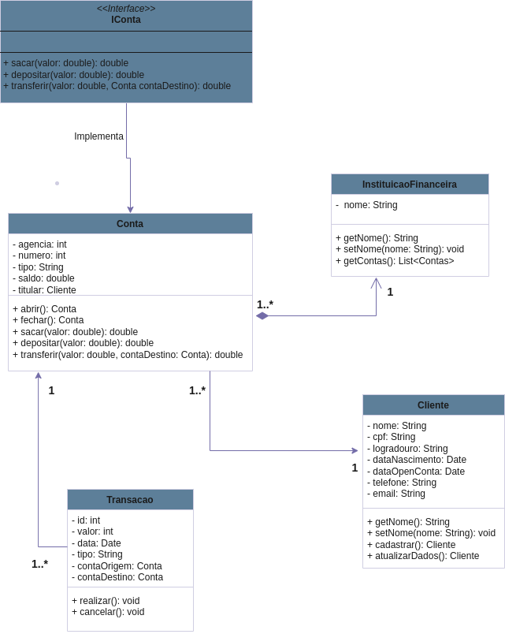

# Desafio Dio Banco Digital #

Estamos criando um banco que tem dois tipos de contas (Conta Corrente e Conta Poupança), onde possuem as funcionalidades de depósito, saque e transferência (entre contas de mesma instituição). 
Em consideração ao nosso conhecimento bancário, iremos abstrair uma solução Orientada a Objetos em Java.

 